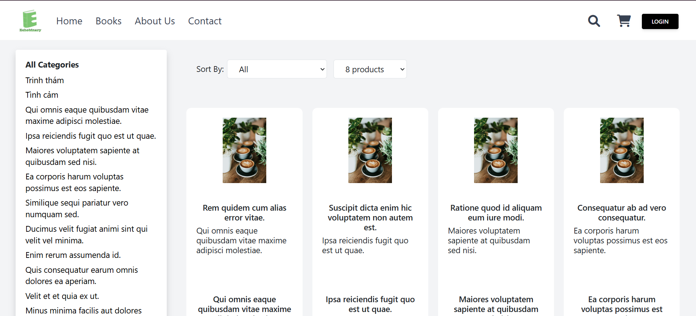
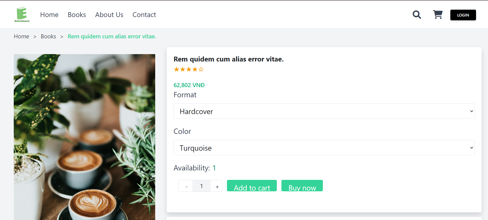

# Design Wireframe for E-Commerce Bookstore

### Team Members: 4  
**Timeline:** May 25 - June 16 (Completed)  

## Table of Contents
- [Home Page](#home-page)  
- [Books Page](#books-page)  
- [Book Details](#book-details)  
- [Cart Page](#cart-page)  
- [Popup Cart](#popup-cart)  
- [Checkout Page](#checkout-page)  
- [Thank You Page](#thank-you-page)

---

## Home Page  

  

The homepage includes:  
- **Search Bar**: Allows users to search for books by name, author, or genre.  
- **Cart Icon**: Displays products added to the cart.  
- **Main Features**:  
  - Brand introduction banner.  
  - Highlighted book categories such as priority reads, bestsellers, trending books, and popular authors.  

---

## Books Page  

  

Displays a catalog of books with categories, filters, and sorting options.  

---

## Book Details  

  

The book detail page includes:  
- **Features**:  
  - Quantity selection with increase/decrease buttons.  
  - Buttons for "Add to Cart" and "Buy Now."  
- **Book Information**:  
  - Author's name, available stock, book description, detailed information, and delivery time.  
- **Related Products**:  
  - Recommended and related books displayed below the product details.  

  

---

## Cart Page  

  

The cart page includes:  
- **Selected Products**: Displays books added to the cart.  
- **Actions**:  
  - Modify quantities, delete items, or apply discount codes.  
  - Filter selected products for purchase.  
- **Checkout Button**: Redirects to the checkout page for order confirmation.  

---

## Popup Cart  

  

- **Trigger**:  
  - Hovering over the cart icon or adding a new product updates the cart dynamically.  
- **Display**:  
  - Shows the total number of items in the cart.  

---

## Checkout Page  

  

The checkout page includes:  
- **Buyer Information**: Form to input user details.  
- **Order Review**: List of selected products, total price, and payment options.  

---

## Thank You Page  

  

- **Post-Purchase Summary**: Displays products purchased with order confirmation details.  

---

This README provides a detailed overview of the e-commerce bookstore's design wireframe, ensuring clear communication of the project's structure and functionality.
